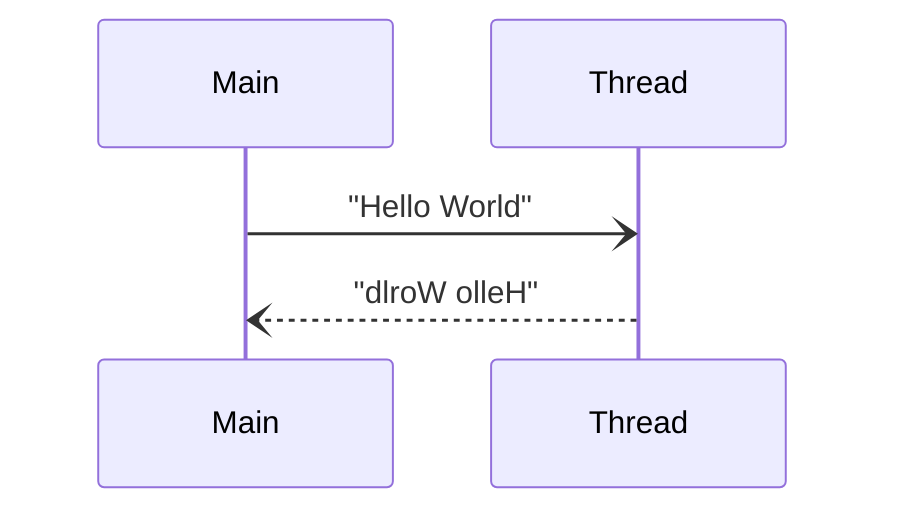

# BoostThreadEchoTest
A test program for Boost Thread Library  

## About This Program
Two contexts communicate with each other by using Boost Thread Library. If "Main" send string to "Thread", "Thread" returns the reversed string.  


## How to Use
### 1. Build This Project
```terminal
gcc main.cpp -o main -IBOOST_PATH/include -lboost_thread-mt -LBOOST_PATH/lib
```
* Sorry, I haven't prepared make or cmake yet and will never do it.  

### 2. Run This Program
```terminal
./main
```

### 3. Send a Message to the Thread
```terminal
Command: 0      // enter the command to send a message
Message: Hello  // enter the message
Message: olleH  // receive the reverced message from the thread
```

### 4. Finish the Thread
```terminal
Command: 1  // finish the thread
```

