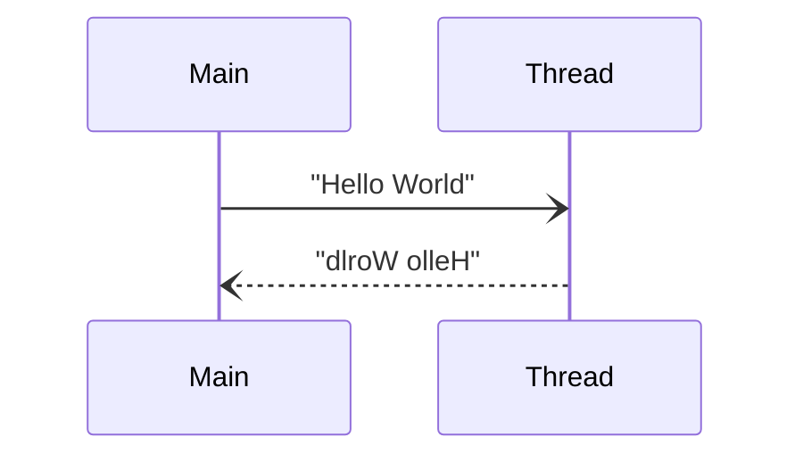

# BoostThreadEchoTest
A test program for Boost Thread Library  

## About This Program
Two contexts communicate with each other by using Boost Thread Library. If "Main" send string to "Thread", "Thread" returns the reversed string.  


## How to Use
### Build This Project
```terminal
TODO: write here
```

